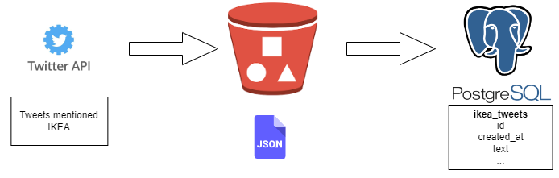

# ikea-tweets

Build a data pipeline to extract tweets mentioning IKEA and store them in tables that can be queried. 
Data is ingested from Twitter API, then moved to S3 bucket, and then transformed into tables in AWS Postgres.

### Architecture

### Prerequisite
1. You will need:
-   [Twitter Developer](https://developer.twitter.com/) account (free)
-   [AWS](https://aws.amazon.com/) account (12-month free tier)

2. Add your AWS and Twitter keys
3. Specify your AWS S3 bucket

### Future work
- Set up Airflow ochestration
- Create more data models: e.g., table `users` that is linked with table `ikea_tweets` by  foreign key `user_id`
- Create layers for data transformation: staging and mart layer
